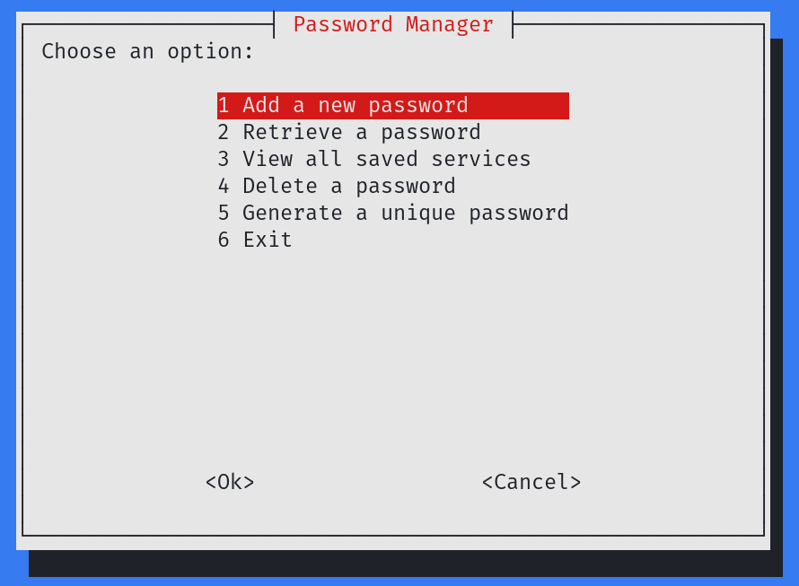
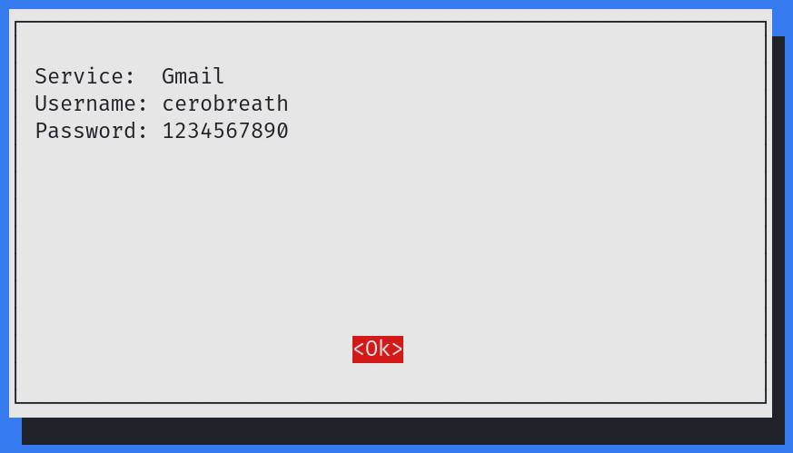
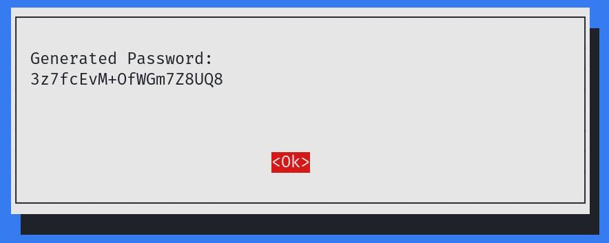

# PassMaster

A lightweight and secure password manager built in Bash, featuring AES-256 encryption, a user-friendly dialog interface, and support for managing multiple services with usernames and passwords. Perfect for shell enthusiasts who prioritize simplicity and data protection.

## Features

- **Cross-Platform Support**: Works out of the box on various Linux distributions with dependency checks.
- **Secure Storage:** Passwords are encrypted with AES-256.
- **User Authentication:** A passphrase is required to access the stored passwords.
- **Service-Based Organization:** Passwords are categorized by service name and username.
- **Password Management Options:** Add, retrieve, edit, and delete stored passwords.
- **Password Generation:** Generate unique passwords directly from the program.

## Screenshots

### Main Menu


### Add and Retrieve Passwords


### Generate Password


## Installation

1. Clone the repository:
   ```bash
   git clone https://github.com/cerobreath/PassMaster.git
   cd PassMaster
   ```

2. Make the script executable:
   ```bash
   chmod +x passmaster.sh
   ```

3. Run the script:
   ```bash
   ./passmaster.sh
   ```

## Prerequisites

PassMaster automatically checks for and installs the required dependencies:

- **OpenSSL**: For AES-256 encryption.
- **Whiptail**: For the dialog-based user interface.

If the required tools are not installed, PassMaster will attempt to install them using the package manager available on your system (e.g., apt, dnf, pacman).

## How It Works

1. **Initialization**:
   - The program initializes by loading necessary modules and configuration files.
   - It establishes a secure environment for handling user credentials and sensitive data.

2. **Password Storage**:
   - User credentials for different services are securely encrypted and stored in a structured database.
   - Each entry includes service name, username, and password, all protected by advanced cryptographic methods.

3. **Data Retrieval**:
   - Users can search for stored credentials using a service name or other identifiers.
   - The program retrieves and decrypts the requested credentials for display or use.

4. **Password Generation**:
   - The system generates strong, random passwords using a robust algorithm, ensuring high security.

## Security

- **Strong Encryption**: Employs state-of-the-art cryptographic techniques to safeguard your data.
- **Secure Database**: All sensitive information is stored in an encrypted database with restricted access.
- **Local Processing**: No data is transmitted to external servers, ensuring complete user privacy.

## Contributing

Contributions are welcome! If you find a bug or have a feature request, feel free to open an issue or submit a pull request.

## Disclaimer

The software is provided as-is, without any guarantees. Use it responsibly and always back up your data.