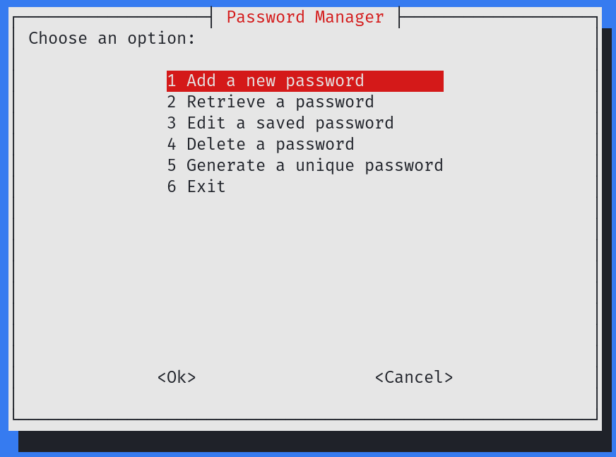

# PassMaster

A lightweight and secure password manager built in Bash, featuring AES-256 encryption, a user-friendly dialog interface, and support for managing multiple services with usernames and passwords. Perfect for shell enthusiasts who prioritize simplicity and data protection.

## Features

- **Cross-Platform Support**: Works out of the box on various Linux distributions with dependency checks.
- **AES-256 Encryption**: Ensures all stored passwords are securely encrypted.
- **User-Friendly Interface**: Easy-to-navigate dialog-based menus.
- **Password Management**: Add, retrieve, view, and delete service credentials.
- **Password Generator**: Create secure, randomly generated passwords of custom lengths.
- **No External Dependencies**: Uses built-in tools (OpenSSL and Whiptail) available on most Linux systems.

## Screenshots

### Main Menu


### Add and Retrieve Passwords


### Generate Password


## Installation

1. Clone the repository:
   ```bash
   git clone https://github.com/cerobreath/PassMaster.git
   cd PassMaster
   ```

2. Make the script executable:
   ```bash
   chmod +x passmaster.sh
   ```

3. Run the script:
   ```bash
   ./passmaster.sh
   ```

## Prerequisites

PassMaster automatically checks for and installs the required dependencies:

- **OpenSSL**: For AES-256 encryption.
- **Whiptail**: For the dialog-based user interface.

If the required tools are not installed, PassMaster will attempt to install them using the package manager available on your system (e.g., apt, dnf, pacman).

## How It Works

1. **Initialization**:
    - The script creates a secure directory (`safe`) to store encrypted files.
    - A master passphrase is set during the first run, used for encrypting and decrypting data.

2. **Password Storage**:
    - Each service credential is encrypted with AES-256 and stored as a separate file.
    - An encrypted index file maintains mappings of service names, usernames, and file references.

3. **Data Retrieval**:
    - Decrypts the index file to present a list of saved services.
    - The user selects a service to retrieve the credentials, which are decrypted on-the-fly.

4. **Password Generation**:
    - Securely generates random passwords using OpenSSL.

## Security

- **AES-256 Encryption**: Industry-standard encryption ensures your passwords remain protected.
- **Secure Storage**: All files are stored with restricted permissions.
- **No External Servers**: All data remains local to your system.

## Contributing

Contributions are welcome! If you find a bug or have a feature request, feel free to open an issue or submit a pull request.

## Disclaimer

PassMaster is provided as-is, without any guarantees. Use it responsibly and always back up your data.